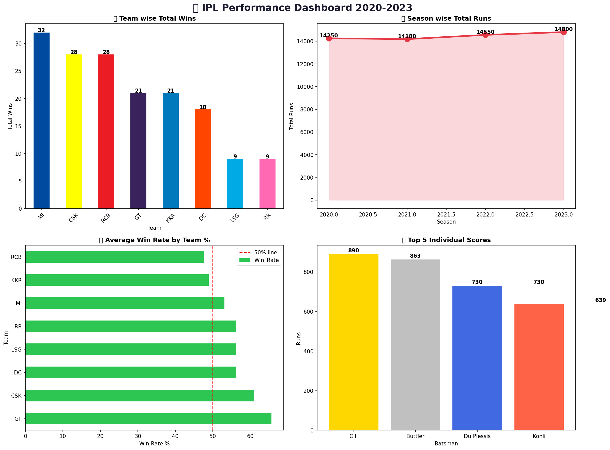

# -IPL-cricket-analysis
# 🏏 IPL Performance Dashboard 2020-2023

## Overview
Analysed IPL team and player performance data 
from 2020 to 2023 to uncover winning trends, 
top scorers, and team statistics using Python 
and data visualization.

## Tools Used
- Python (Pandas, NumPy, Matplotlib, Seaborn)
- Google Colab
- Dataset: Custom IPL Dataset (2020-2023)

## Key Insights
- 🏆 MI leads with 32 total wins (2020-2023)
- 📈 Total runs increased from 14,250 to 14,800
- 🎯 GT has highest win rate at 65%
- 👑 Shubman Gill top scorer with 890 runs

## Dashboard Preview

## Files
- `ipl_data.csv` — Cleaned IPL dataset
- `ipl_dashboard.png` — Performance charts
- `IPL_Analysis.ipynb` — Python notebook
